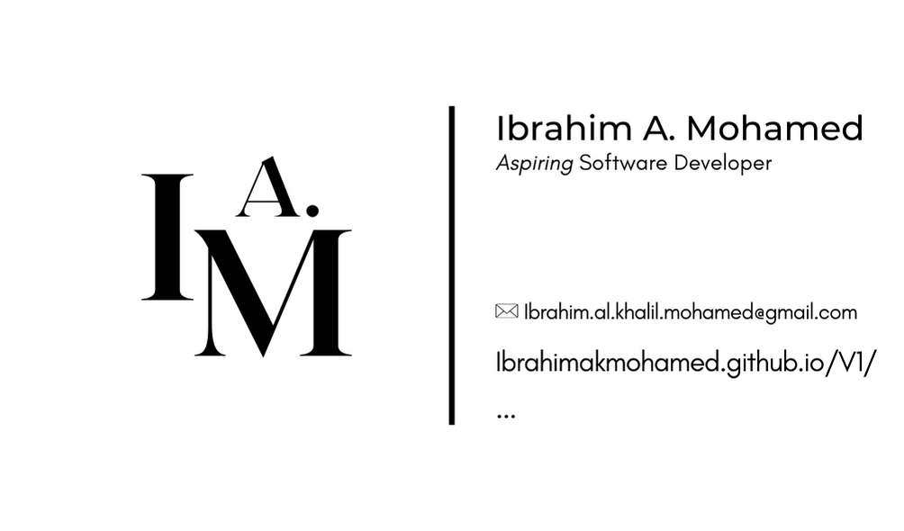

## Ibrahim Mohamed's GitHub Page

Welcome to my GitHub repository! I am Ibrahim Mohamed, a dedicated individual with a keen interest in Software Development , my main area of interest is Web Development . This repository showcases various projects I have worked on, demonstrating my skills and experience in web development, design, and programming.

## Table of Contents
- [Introduction](#Introduction)
- [Projects](#Projects)
- [Anything Recruitment™](Anything-Recruitment™)
- 
- 
- 
- 

## Introduction
My journey into the world of technology began during my early school years, where I first encountered programming by discovering the inspect element tool - Playing with Text. Since then, my fascination with software development has only grown stronger, leading me to pursue various self-taught projects and formal education opportunities.

## Projects

## Anything Recruitment™
-Description: Designed and developed a comprehensive website for Anything Recruitment™, a recruitment agency based in Coventry.
- Features:
-    Custom logo incorporated in the NavBar and Footer
-    Designed and implemented a custom favicon
-    Unique logo and color scheme
-    Configured hosting and custom domain name (published at anythingrecruitment.uk)
   

<!--
**IbrahimAKMohamed/IbrahimAKMohamed** is a ✨ _special_ ✨ repository because its `README.md` (this file) appears on your GitHub profile.

Here are some ideas to get you started:

- 🔭 I’m currently working on ...
- 🌱 I’m currently learning ...
- 👯 I’m looking to collaborate on ...
- 🤔 I’m looking for help with ...
- 💬 Ask me about ...
- 📫 How to reach me: ...
- 😄 Pronouns: ...
- ⚡ Fun fact: ...
-->
